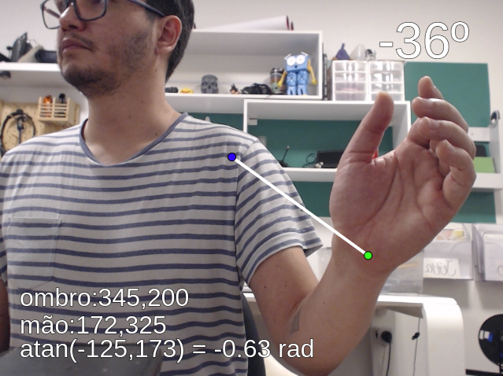

# Ângulos

Esta demonstração calcula um ângulo a partir de dois pontos estimados pelo modelo de poses.

O ângulo é calculado da seguinte forma:

    cateto oposto = ombroDireito.y - maoDireita.y
    cateto adjacente = ombroDireito.x - maoDireita.x
    ângulo em radianos = atan(cateto_oposto, cateto_adjacente)
    ângulo em graus = ângulo em radianos * 180 / Pi

A demonstração exibe os dados na tela fazendo o cálculo apenas para o braço direito, para melhor didática.

